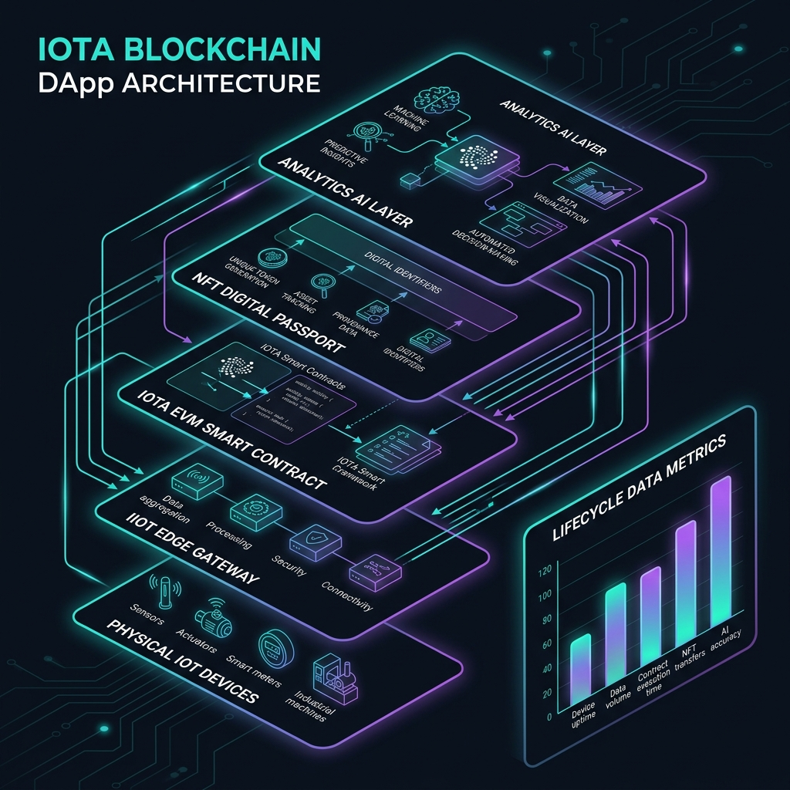
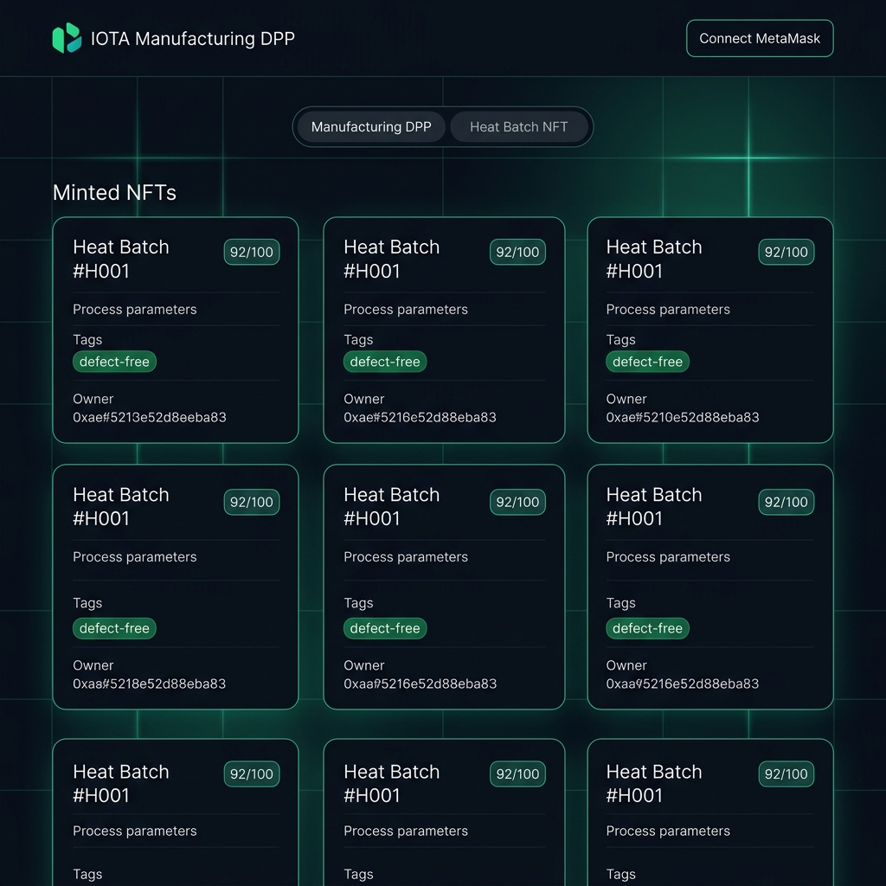

# IOTA Enterprise Digital Product Passport (DPP) Portal

[](https://soliditylang.org/)
[](LICENSE)
[](https://book.getfoundry.sh/)
[](https://iota-dpp.vercel.app)

> 🚀 **Live Portal Frontend:** [iota-dpp.vercel.app](https://iota-dpp.vercel.app)  
> 🔗 **Network:** Ethereum Sepolia Testnet | **Chain ID:** 11155111  
> 📋 **TraceabilityPortal Explorer:** [View on Sepolia Etherscan](https://sepolia.etherscan.io/address/0x8C6e7e14958658b2559c689734Df50b626BFD69A)  
> 📖 **Architecture & Deep Dive Documentation:** [docs/PROJECT_GUIDE.md](docs/PROJECT_GUIDE.md)

---

## Overview

This repository implements a **blockchain-enabled Digital Product Passport (DPP)** system. Designed for high-value manufacturing (like investment casting foundries producing safety-critical aerospace turbine blades), it decouples the industrial lifecycle into **7 separate ERC-721 NFT contracts** coordinated by a central orchestrator portal. 

This architecture records and links workers, machinery telemetry, calibrations, QA inspection scores, and ERP logistics onto the blockchain.

```
                  ┌──────────────────────┐
                  │  TraceabilityPortal  │
                  └──────────┬───────────┘
         ┌─────┬─────┬───────┼───────┬─────┬─────┐
         ▼     ▼     ▼       ▼       ▼     ▼     ▼
       ⚙️     👤    ⛓       🔩      📜    🔧    💼
      Eq    Mp    Pr      Pd      Ql    Mt    Bz
```

---

## Decoupled Smart Contract Deployments (Sepolia)

| Contract | Address | Description |
|---|---|---|
| 🛡️ **TraceabilityPortal (Portal)** | [`0x8C6e7e14958658b2559c689734Df50b626BFD69A`](https://sepolia.etherscan.io/address/0x8C6e7e14958658b2559c689734Df50b626BFD69A) | Central gateway for mints and passport lookups. |
| ⚙️ **EquipmentNFT** | [`0x53F3cB642E2985fb7fE97a96788c7457B19d8a55`](https://sepolia.etherscan.io/address/0x53F3cB642E2985fb7fE97a96788c7457B19d8a55) | Machinery asset telemetry & calibration. |
| 👤 **ManpowerNFT** | [`0xa0e928EC402466c27E36aAAc4Fae9DC8dAf0743d`](https://sepolia.etherscan.io/address/0xa0e928EC402466c27E36aAAc4Fae9DC8dAf0743d) | Operator qualification & signatures. |
| ⛓ **ProcessNFT** | [`0xE04Ac7A16f060596148e52264ccf960b24bAC780`](https://sepolia.etherscan.io/address/0xE04Ac7A16f060596148e52264ccf960b24bAC780) | Melt casting process parameters. |
| 🔩 **ProductNFT** | [`0x305e2de338AE963E88747CF5d36f02106766Ee19`](https://sepolia.etherscan.io/address/0x305e2de338AE963E88747CF5d36f02106766Ee19) | Final physical casting component passport. |
| 📜 **QualityNFT** | [`0xbF723D781f6e799e7d9F3f1D4D0B0a86FEe93e6a`](https://sepolia.etherscan.io/address/0xbF723D781f6e799e7d9F3f1D4D0B0a86FEe93e6a) | NDT QA score and AI defect model logs. |
| 🔧 **MaintenanceNFT** | [`0x97B739a219bA5E247fD68aB178353965f313b171`](https://sepolia.etherscan.io/address/0x97B739a219bA5E247fD68aB178353965f313b171) | Preventive care & downtime logs. |
| 💼 **BusinessNFT** | [`0x1F060B42De10B29eFf7b837E85F621a650EBFC44`](https://sepolia.etherscan.io/address/0x1F060B42De10B29eFf7b837E85F621a650EBFC44) | Commercial order POs and logistics trail. |

---

## Project Structure

```
Iota-Project-Phase-4/
├── docs/
│   └── PROJECT_GUIDE.md          # Comprehensive architectural specs
├── script/
│   └── DeployV3.s.sol            # Decoupled deploy & link scripts
├── src/
│   ├── TraceabilityPortal.sol    # Coordinator Portal
│   ├── EquipmentNFT.sol          # Stage 1
│   ├── ManpowerNFT.sol           # Stage 2
│   ├── ProcessNFT.sol            # Stage 3
│   ├── ProductNFT.sol            # Stage 4
│   ├── QualityNFT.sol            # Stage 5
│   ├── MaintenanceNFT.sol        # Stage 6
│   └── BusinessNFT.sol           # Stage 7
├── test/
│   └── TraceabilityPortal.t.sol  # Pipeline integration tests
├── index.html                    # Redesigned digital twin frontend dashboard
├── foundry.toml
└── README.md
```

---

## Quick Start & Running Locally

Follow these steps to run, deploy, and test the project in a local environment:

### 1. Installation
Clone the repository and fetch the submodules containing the necessary OpenZeppelin libraries:
```bash
git clone --recurse-submodules https://github.com/Dhruv4848l/Iota-Project-Phase-4.git
cd Iota-Project-Phase-4
```

### 2. Build and Test
Compile the Solidity smart contracts and run the unit/integration tests to verify compilation:
```bash
# Compile the decoupled contracts
forge build

# Run the complete test suite (74 tests)
forge test -vv
```

### 3. Running a Local Node & Deploying
To test contract interaction locally:
1. Start a local Ethereum RPC node in a terminal:
   ```bash
   anvil
   ```
2. Deploy the 7 NFT contracts and the TraceabilityPortal coordinator to the local node:
   ```bash
   # Running deploy script against anvil
   forge script script/DeployV3.s.sol --rpc-url http://localhost:8545 --broadcast
   ```
3. Copy the deployed contract addresses printed in the terminal output and update the corresponding address constants inside the javascript block of [index.html](file:///D:/IOTA/Iota-Project-Phase-4/index.html) (e.g. `PORTAL_ADDRESS`).

### 4. Launch the Frontend
MetaMask blocks transaction requests from raw file system origins (`file://`). Host the frontend locally using a simple HTTP server:
```bash
# Start a local web server (defaults to port 3000)
npx serve
```
Then navigate to **`http://localhost:3000`** in your browser. Ensure MetaMask is connected to your local RPC network (`http://localhost:8545` with chain ID `31337`) or Ethereum Sepolia Testnet.

---

## 🏛️ System Visualizations

Here is how the physical manufacturing devices, the IOTA EVM, and the 7-stage state machine interface with each other to secure the digital twin:

### 1. 8-Layer IIoT Integration Flow
The physical sensors feed data into edge devices, which compute hashes for IOTA EVM storage and link to IPFS metadata.


### 2. 7-Stage State Machine Lifecycle
Gated state transitions track the component from raw materials to manufacturing, quality checks, logistics, maintenance, and ultimate retirement.


### 3. Digital Twin Portal Dashboard
An interactive dashboard displaying live statistics, role qualifiers, token lookups, and transaction dispatch forms.


---

## 📊 Project Presentation (PPTX)

A comprehensive presentation slide deck detailing the project has been generated and pushed to the repository root:
* **[IOTA_EVM_NFT_Lifecycle_Management.pptx](file:///D:/IOTA/Iota-Project-Phase-4/IOTA_EVM_NFT_Lifecycle_Management.pptx)**

### Slide Deck Contents:
1. **The Problem We Solve:** Fragmented logs, tampering risks, audit barriers, and component fraud.
2. **The Web3 Solution:** Layer 0 Digital Product Passport NFTs.
3. **8-Layer System Architecture:** Device-to-Blockchain-to-Metaverse lifecycle telemetry loop.
4. **Decoupled Contract Architecture:** Separating high-complexity operations into 7 sub-contracts.
5. **Lifecycle State Machine:** Sequential stages, role-based transitions, and metadata freeze.
6. **Carbon & ESG Auditing:** Logging greenhouse metrics at each stage for green audits.
7. **Unified DApp Frontend Dashboard:** switchers, dynamic tabs, MetaMask connections, and lookups.
8. **Roadmap & Future Vision:** AI-prognosis, machine-oracles, and W3C DIDs.

---

For a deep dive into the engineering logic, AI defect rating indicators, and step-by-step metadata schemas, read [docs/PROJECT_GUIDE.md](docs/PROJECT_GUIDE.md).

