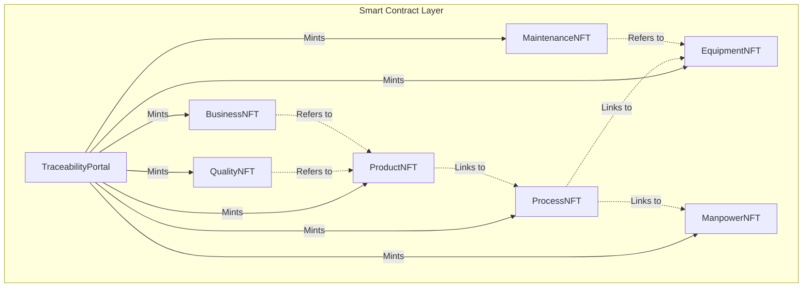

# Blockchain-Enabled Digital Product Passport (DPP) Traceability System

This documentation provides an in-depth breakdown of the decoupled, 7-stage blockchain-based Digital Product Passport (DPP) traceability system deployed on Ethereum Sepolia.

---

## 1. Problem Statement & Solution

### The Problem
Aerospace and defense manufacturing ecosystems (such as investment casting foundries producing safety-critical turbine blades) face strict compliance requirements. 
Traditional audits suffer from:
* **Data Silos**: Process parameters, technician certifications, machinery calibrations, and quality tests are stored in fragmented databases.
* **Lack of Trust**: External machining vendors, OEMs, and airlines have no single immutable source of truth to verify part pedigree.
* **Auditing Overhead**: Manually tracing physical parts back to specific heat batches, worker training records, and machine calibration certificates takes days.
* **Tamper Vulnerability**: Paper logs or centralized database logs can be edited retroactively.

### The Solution: A Decoupled 7-Stage Digital Twin Hierarchy
Our platform solves this by mapping the complete physical lifecycle of high-value parts onto the blockchain. By decoupling the lifecycle phases into **7 separate ERC-721 NFT contracts** coordinated by a **Traceability Portal**, we create an auditable, immutable, and easily queryable digital product passport.

---

## 2. Decoupled Architecture



### Dynamic Resolution: The Digital Twin Passport
A single query to `TraceabilityPortal.getFullPassport(productId)` returns a unified digital twin of the part's entire history:
1. **Product Data** is retrieved from the `ProductNFT` contract.
2. The portal uses the linked `processId` to query the `ProcessNFT` contract.
3. The `ProcessNFT` metadata points to the `EquipmentNFT` (machinery used) and `ManpowerNFT` (technician assigned).
4. The portal aggregates all independent inspection/certification records from `QualityNFT` (linked via `productId`).
5. It queries preventive servicing histories from `MaintenanceNFT` (linked via `equipmentId`).
6. It fetches order and dispatch logs from `BusinessNFT` (linked via `productId`).

---

## 3. The 7 NFT Lifecycle Stages & Parameter Schemas

### ⚙️ 1. Equipment NFT
Represents the physical machinery (e.g. Vacuum Induction Melting furnace, mold press, inspection device).
* **Machine ID**: Unique enterprise equipment number.
* **Machine Type**: Furnace, mixer, press, autoclave, NDT scanner.
* **Manufacturer**: OEM supplier name.
* **Model & Serial Number**: Part identity keys.
* **Installation Date**: Commissioning timestamp.
* **Calibration Status**: Valid / Warning / Expired.
* **Maintenance History Hash**: IPFS reference to external calibration records.
* **Location**: Specific shop-floor coordinates.

### 👤 2. Manpower NFT
Records worker qualifications and digital authorization sign-offs.
* **Operator ID**: Unique employee identifier.
* **Shift**: Assigned schedule (Morning / Evening / Night).
* **Skill Category**: Vacuum Melting, Pouring, Shell Casting, NDT.
* **Training Certification**: IPFS link to training compliance records.
* **Digital Signature**: Cryptographic signature validation.

### ⛓ 3. Process NFT
Captures the casting melt process telemetry.
* **Heat / Batch Number**: Unique melting batch.
* **Wax Parameters**: Wax injection temperature, pressure, time.
* **Slurry Properties**: Viscosity (Primary & Backing), Slurry Density (Primary & Backing).
* **Pouring Parameters**: Pouring temperature, preheating temperature, pouring speed.
* **Atmospheric Data**: Humidity, room temperature, cycle duration.
* **Equipment & Manpower Links**: Refers to the specific machine and operator NFTs used.

### 🔩 4. Product NFT
Identifies the final physical part (e.g. Turbine Blade, Nozzle Guide Vane).
* **Part Name**: Commercial product name.
* **Alloy Grade**: High-temperature superalloy grade (e.g. Inconel 718, Mar-M-247).
* **Casting Batch ID**: Reference casting run.
* **Process Link**: Refers to the specific process NFT batch.
* **Engineering Drawing Hash**: IPFS drawing citation.

### 📜 5. Quality Certificate NFT
Stores quality assurance test logs and automated AI predictions.
* **Quality Score**: NDT evaluation score (0-100).
* **AI Defect Prediction**: Risk model outputs (Low / Moderate / High).
* **Inspection Evaluation**: Inspector text log.
* **Defect Flags**: Boolean checks for Distortion, Rough Surface, Shrinkage, Slag Inclusions.
* **Product Link**: Refers to the Product NFT ID.

### 🔧 6. Maintenance NFT
Anchors machinery repair logs to prevent process drifts.
* **Preventive PM Action**: Description of parts serviced/swapped.
* **Calibration Log**: Offsets applied.
* **Downtime**: Total machine hours lost.
* **Next Service Date**: Target timestamp for next recalibration.
* **Equipment Link**: Refers to the Equipment NFT ID.

### 💼 7. Business Value NFT
Bridges shop-floor data to enterprise ERP logs.
* **PO Number**: Customer Purchase Order.
* **Invoice Reference**: Bill of lading / shipping invoices.
* **Valuation / Revenue**: Part contract cost in USD.
* **Dispatch Date**: Logistics handoff date.
* **Logistics Tracker Hash**: IPFS receipt for global supply chain routing.
* **Product Link**: Refers to the Product NFT ID.

---

## 4. Deployed Smart Contracts

The contracts are live on **Ethereum Sepolia Testnet** under the following addresses:

| Contract | Address |
|---|---|
| **TraceabilityPortal (Orchestrator)** | `0x8C6e7e14958658b2559c689734Df50b626BFD69A` |
| **EquipmentNFT** | `0x53F3cB642E2985fb7fE97a96788c7457B19d8a55` |
| **ManpowerNFT** | `0xa0e928EC402466c27E36aAAc4Fae9DC8dAf0743d` |
| **ProcessNFT** | `0xE04Ac7A16f060596148e52264ccf960b24bAC780` |
| **ProductNFT** | `0x305e2de338AE963E88747CF5d36f02106766Ee19` |
| **QualityNFT** | `0xbF723D781f6e799e7d9F3f1D4D0B0a86FEe93e6a` |
| **MaintenanceNFT** | `0x97B739a219bA5E247fD68aB178353965f313b171` |
| **BusinessNFT** | `0x1F060B42De10B29eFf7b837E85F621a650EBFC44` |

---

## 5. Running the Project Locally

### Cloning & Setup
```bash
git clone --recurse-submodules https://github.com/Dhruv4848l/Iota-Project-Phase-4.git
cd Iota-Project-Phase-4

# Ensure submodules are up to date
git submodule update --init --recursive
```

### Compiling and Testing Solidity Contracts
Requires **Foundry** toolchain:
```bash
# Compile contracts
forge build

# Run unit tests
forge test -vv
```

### Running the Frontend Locally
Because MetaMask blocks `file://` origins from connecting to the Ethereum provider, you must launch the frontend under a local web server:
```bash
# Option A: Python server
python -m http.server 8000

# Option B: Node server
npx serve
```
Then visit `http://localhost:8000` (or the port specified by serve) in your browser.
